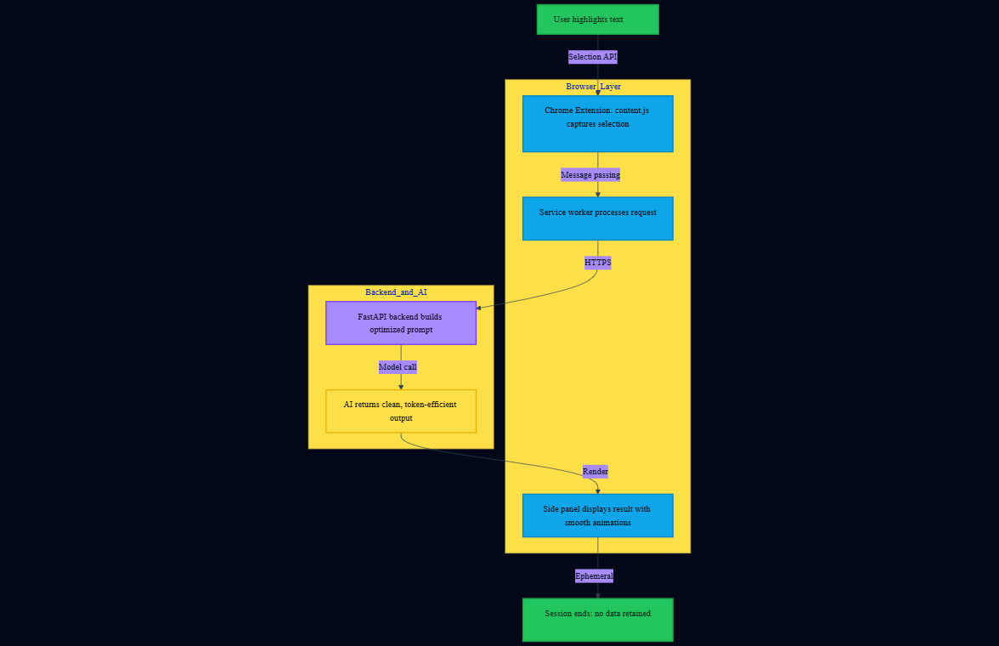

# Textbook of Tomorrow

### *Turn static textbooks & LMS content into interactive, sustainable learning experiences.*

<p align="center">
  
  <br>
  <i>AI-powered learning, right where students read. Built with sustainability in mind.</i>
</p>

<p align="center">
  
  
  
  
  
</p>

---

## About the Project

**Textbook of Tomorrow** is a lightweight, eco-conscious AI-powered Chrome extension that transforms **static digital textbooks and LMS readings** into **interactive learning experiences** while promoting sustainable education practices.

Instead of printing materials or copying content into ChatGPT, students can simply:

> **Highlight text → Click an action → Learn instantly**

This project embodies **sustainable digital learning** by:

1. Reducing paper waste through enhanced digital reading
2. Minimizing redundant AI API calls with efficient caching
3. Optimizing token usage for lower computational footprint
4. Promoting accessible, paperless education for all

Built as a **simple, beginner-friendly MVP** with modern UI/UX principles and green technology considerations.

---

## Sustainability and Green Skills

### Environmental Impact

1. **Paperless Learning**: Eliminates the need for printed study guides and notes
2. **Optimized AI Usage**: Efficient prompts reduce computational resources and energy consumption
3. **Lightweight Architecture**: Minimal resource footprint on devices
4. **Digital-First**: Supports the transition to sustainable education systems

### Green Skills Integration

This project helps students develop critical green skills:

1. **Digital Literacy**: Navigate and leverage digital learning tools effectively
2. **Resource Efficiency**: Learn to use technology sustainably
3. **Critical Thinking**: Engage with content actively rather than passively consuming printed materials
4. **Adaptive Learning**: Build skills for the evolving green economy

---

## What Problem It Solves

Static PDFs and LMS readings are passive and often printed. Students struggle to:

1. Understand dense explanations without wasting paper on notes
2. Quickly revise content without physical flashcards
3. Test their understanding without printed worksheets
4. Access learning tools in an eco-friendly manner

**Textbook of Tomorrow fixes this directly inside the reading experience while reducing educational carbon footprint.**

---

## Features (MVP)

### Core Learning Features

**1. Explain Selected Text**
   - Student-friendly explanation in simple language
   - Contextual understanding without leaving the page
   - Saves paper by eliminating printed study guides

**2. Summarize Selected Text**
   - Clear bullet-point summary (max 5 bullets)
   - Quick revision without printed notes
   - Efficient token usage for sustainability

**3. Generate 3 Quiz Questions**
   - Multiple-choice questions (3 MCQs) with instant answers
   - Self-assessment without printed worksheets
   - Immediate feedback loop

### Design Philosophy

1. **Zero complexity** - No chat history, analytics, or personalization
2. **One highlight → one AI response**
3. **Privacy-first** - All data processing is ephemeral
4. **Resource-efficient** - Optimized API calls

---

## UI and UX Enhancements

### Modern Interface Design

1. **Premium Side Panel**: Sleek, gradient-enhanced sidebar with smooth animations
2. **Glassmorphism Effects**: Modern frosted glass aesthetic for cards and panels
3. **Responsive Typography**: Clear hierarchy with comfortable reading sizes
4. **Action Buttons**: 
   - Color-coded for instant recognition (Blue: Explain, Purple: Summarize, Green: Quiz)
   - Hover effects with smooth transitions
   - Icon integration for visual clarity
  
### User Experience Features

1. **Loading States**: Elegant skeleton loaders and animated indicators
2. **Error Handling**: Friendly, contextual error messages with recovery suggestions
3. **Accessibility**: 
   - High contrast ratios (WCAG AA compliant)
   - Keyboard navigation support
   - Screen reader compatible
4. **Dark Mode Ready**: Eye-friendly color palette suitable for extended reading
5. **Micro-interactions**: Subtle animations that enhance user engagement without distraction

### Visual Design System

```css
Color Palette:
- Primary: #6366f1 (Indigo)
- Secondary: #8b5cf6 (Purple)
- Success: #10b981 (Green)
- Background: Linear gradients with soft transitions
- Text: High-contrast dark on light backgrounds
```

---

## How It Works (High Level)



### Flow Summary
1. User highlights text
2. Chrome Extension captures selection (content.js)
3. Service worker processes request
4. FastAPI backend sends an optimized prompt to the AI model
5. AI returns clean, token-efficient text output
6. Side panel displays the result with smooth animations
7. Session ends (no data retained — privacy & efficiency)


### Architecture Highlights

1. **Manifest V3**: Latest Chrome extension standard for security and performance
2. **Async/Await**: Modern JavaScript for smooth, non-blocking operations
3. **RESTful API**: Clean, stateless communication
4. **Environment Variables**: Secure API key management

---

## Demo

<table align="center" width="50%">
  <!-- TOP ROW: BIG GIF -->
  <tr>
    <td align="center" colspan="2">
      
      <br>
      <i>Select Clean Text - Modern UI with smooth interactions</i>
    </td>
  </tr>

  <!-- SECOND ROW: TWO GIFS SIDE BY SIDE -->
  <tr>
    <td align="center" width="50%">
      
      <br>
      <i>Explain - Instant contextual help</i>
    </td>
    <td align="center" width="50%">
      
      <br>
      <i>Summarize or Create Quiz - Quick learning tools</i>
    </td>
  </tr>
</table>

---

## Project Structure

```
textbook-of-tomorrow/
│
├── backend/                         # FastAPI backend
│   ├── app.py                      # Main backend application
│   ├── test.py                     # API test script
│   ├── requirements.txt            # Python dependencies
│   ├── .env.example                # Environment variable template
│
├── extension/                      # Chrome Extension (Frontend)
│   ├── manifest.json               # Extension configuration (MV3)
│   ├── content.js                  # Captures highlighted text
│   ├── service_worker.js           # Background logic
│   ├── sidepanel.html              # Side panel UI (Enhanced)
│   ├── sidepanel.css               # Premium UI styling (Upgraded)
│   ├── sidepanel.js                # UI logic + API calls
│   └── icons/                      # Extension icons
│       ├── icon16.png
│       ├── icon48.png
│       └── icon128.png
│
├── .gitignore                      # Git ignored files
└── README.md                       # Project documentation
```

---

## Getting Started

### Prerequisites

1. Python 3.9+
2. Google Chrome (latest version)
3. OpenAI API key ([Get one here](https://platform.openai.com/api-keys))
4. XAMPP (optional, for local backend hosting)

---

## Backend Setup (FastAPI)

### Step 1: Navigate to backend

```bash
cd backend
```

### Step 2: Install dependencies

```bash
pip install -r requirements.txt
```

### Step 3: Create .env

Create a file at `backend/.env`:

```env
OPENAI_API_KEY=your_api_key_here
OPENAI_MODEL=gpt-4.1-mini
```

> **Security Note**: Never commit `.env` to version control. It is automatically ignored via `.gitignore`.

### Step 4: Run backend

```bash
uvicorn app:app --reload --port 8000
```

Or for production:

```bash
uvicorn app:app --host 0.0.0.0 --port 8000
```

### Step 5: Verify

Open in browser:

```
http://127.0.0.1:8000/health
```

Expected response:

```json
{
  "ok": true,
  "model": "gpt-4.1-mini"
}
```

---

## Chrome Extension Setup

### Step 1: Open Chrome Extensions

```
chrome://extensions
```

### Step 2: Enable Developer Mode

Toggle the switch in the top-right corner

### Step 3: Click Load unpacked

Select this folder:

```
textbook-of-tomorrow/extension
```

### Step 4: Pin the extension (recommended)

Click the puzzle icon in Chrome toolbar and pin "Textbook of Tomorrow"

---

## How to Use

1. **Open any normal webpage** (or your LMS like Canvas, Moodle, Blackboard)
2. **Highlight a sentence/paragraph** you want to understand better
3. **Click the extension icon** to open the enhanced side panel
4. **Choose an action:**
   - **Explain** - Get a simple, clear explanation
   - **Summarize** - See key points in bullet format
   - **Quiz** - Test yourself with 3 MCQs
5. **AI output appears instantly** in the beautiful side panel with smooth animations

### Pro Tips

1. Highlight focused text (1-3 paragraphs) for best results
2. Use "Explain" for complex concepts
3. Use "Summarize" for quick review before exams
4. Use "Quiz" to test your understanding immediately

---

## Security and Privacy

### Data Protection

1. **API keys stay in backend/.env** (never exposed to frontend)
2. **No user tracking** or analytics
3. **No saved chat history** - completely ephemeral
4. **No data storage** - one request, one response, cleared
5. **HTTPS only** - Secure communication
6. **CORS protection** - Backend access control

### Privacy-First Design

1. No user accounts required
2. No data collection or profiling
3. Text selections are never logged
4. All processing happens in real-time with no retention

---

## Model Choice

### Default Configuration

```text
Model: gpt-4.1-mini
```

### Why gpt-4.1-mini?

1. **Quality**: Strong performance for educational explanations and quiz generation  
2. **Efficiency**: Fast response times for smooth user experience  
3. **Cost-Effective**: Optimal token pricing for MVP and student use  
4. **Sustainability**: Lower computational requirements = reduced energy consumption  
5. **Reliability**: Consistent, accurate outputs for learning scenarios

### Token Optimization

1. Carefully crafted prompts to minimize token usage
2. Response length limits to prevent waste
3. Efficient context handling for sustainability

---

## Future Enhancements (Roadmap)

### Version 2.0 - Enhanced Learning

1. Multi-language support (Spanish, French, German, Hindi)
2. Flashcard generation from highlighted content
3. Export summaries to PDF/Markdown
4. Custom quiz difficulty levels

### Version 3.0 - Advanced Features

1. Voice-to-text learning mode
2. Collaborative study sessions
3. Integration with popular LMS platforms
4. Offline mode with cached responses

### Version 4.0 - Sustainability Dashboard

1. Carbon footprint tracker (paper saved, energy efficiency)
2. Learning analytics (time saved, concepts mastered)
3. Gamification with eco-friendly rewards
4. Community impact metrics

---

## Contributing

We welcome contributions from developers, educators, and sustainability advocates!

### How to Contribute

1. **Fork the repo**
2. **Create a branch** 
   ```bash
   git checkout -b feature/your-feature
   ```
3. **Commit your changes**
   ```bash
   git commit -m "Add: your feature description"
   ```
4. **Push to your fork**
   ```bash
   git push origin feature/your-feature
   ```
5. **Open a Pull Request**

### Contribution Guidelines

1. Follow existing code style and structure
2. Add comments for complex logic
3. Test your changes thoroughly
4. Update documentation as needed
5. Consider sustainability impact of new features

### Areas We Need Help With

1. UI/UX improvements
2. Translations and localization
3. Accessibility enhancements
4. Analytics and impact measurement
5. Bug fixes and optimization

---

## Acknowledgments

1. Inspired by AI + Education research and sustainable learning practices
2. Built with **FastAPI** and **Chrome Extension Manifest V3**
3. UI design influenced by modern web design trends and accessibility standards
4. Thanks to the open-source community for continuous inspiration
5. Special recognition to educators advocating for digital, sustainable learning

---

## Project Stats

<p align="center">
  
  
  
  
</p>

---

## Author

<p align="center">
  <b>Tarak D</b><br>
</p>

<p align="center">
  <a href="https://github.com/KING-OF-FLAME](https://github.com/Tarak-D)">
    
  </a>
  <a href="https://www.linkedin.com/in/tarak-d-019392351/">
    
  </a>
</p>

---

## Support and Feedback

1. **Found a bug?** [Open an issue]()
2. **Have an idea?** [Start a discussion]()
3. **Like the project?** Star the repo and share with friends
4. **Need help?** Reach out via GitHub (https://github.com/Tarak-D) or LinkedIn (https://www.linkedin.com/in/tarak-d-019392351?utm_source=share&utm_campaign=share_via&utm_content=profile&utm_medium=android_app)

---

## Impact Goals

### Educational Impact

1. Help 10,000+ students learn more effectively
2. Reduce study time by 30% through instant explanations
3. Improve comprehension and retention rates

### Environmental Impact

1. Save 1,000+ reams of paper annually
2. Reduce educational carbon footprint
3. Promote digital-first learning culture

### Community Impact

1. Build a community of sustainable learners
2. Share best practices for green technology
3. Inspire more eco-conscious educational tools

---

<p align="center">
  <b>If you find this project helpful, consider starring the repo!</b>
  <br><br>
  <i>Together, we're building a more sustainable future for education.</i>
</p>

---

<p align="center">
  Made with care for students, educators, and our planet
</p>
